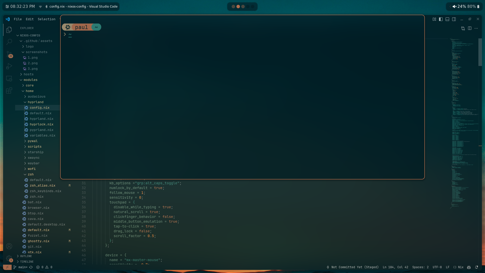
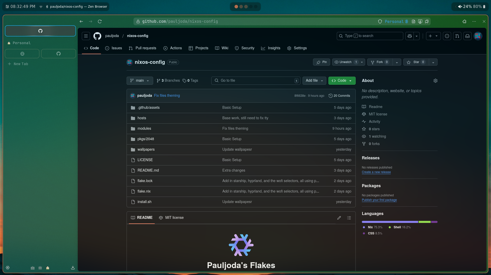
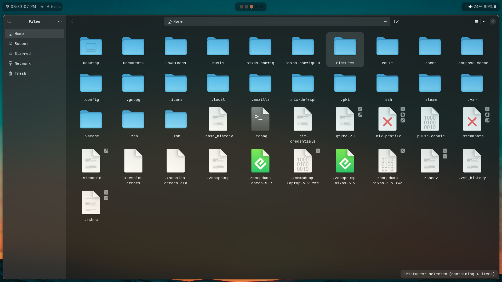

<h1 align="center">
    
   <br>
      Pauljoda's Flakes 
   <br>
       <br>
   <div align="center">

   <div align="center">
      <p></p>
      <div align="center">
      A NixOS and Home Manager setup and dotfiles. Uses pywal to theming. Simple config, uses Ghostty, VSCode, and Zen Browser as main applications
   </div>
</h1>

<br>
</div>

### 🖼️ Gallery

<p align="center">
    <br>
    <br>
    <br>
   Screenshots last updated <b>3-6-25</b>
</p>

# 🗃️ Overview

### 📚 Layout

-   [flake.nix](flake.nix) base of the configuration
-   [hosts](hosts) 🌳 per-host configurations that contain machine specific configurations
    - [desktop](hosts/desktop/) 🖥️ Desktop specific configuration
    - [laptop](hosts/laptop/) 💻 Laptop specific configuration
-   [modules](modules) 🍱 modularized NixOS configurations
    -   [core](modules/core/) ⚙️ Core NixOS configuration
    -   [homes](modules/home/) 🏠 my [Home-Manager](https://github.com/nix-community/home-manager) config
-   [pkgs](flake/pkgs) 📦 packages exported by my flake
-   [wallpapers](wallpapers/) 🌄 wallpapers collection


# 🚀 Installation 

> **⚠️ Use this configuration at your own risk! ⚠️** <br>
> Applying custom configurations, especially those related to your operating system, can have unexpected consequences and may interfere with your system's normal behavior. While I have tested these configurations on my own setup, there is no guarantee that they will work flawlessly on all systems. <br>
> **I am not responsible for any issues that may arise from using this configuration.**

> It is highly recommended to review the configuration contents and make necessary modifications to customize it to your needs before attempting the installation.

1. **Install NixOs**

   First install nixos using any [graphical ISO image](https://nixos.org/download.html#nixos-iso). 
   > Only been tested using the Gnome graphical installer and choosing the ```No desktop``` option durring instalation.

2. **Clone the repo**

   ```
   nix-shell -p git
   git clone https://github.com/Frost-Phoenix/nixos-config
   cd nixos-config
   ```
3. **Install script**

   > First make sure to read the install script, it isn't long
   
   Execute and follow the installation script :
   ```
   ./install.sh
   ```
   > You will need to change the git account yourself in ./modules/home/git.nix
   ```
      programs.git = {
         ...
         userName = "Frost-Phoenix";
         userEmail = "67cyril6767@gmail.com";
         ...
      };
   ```
4. **Reboot**

   After rebooting, you'll be greeted by swaylock prompting for your password, with the wallpaper in the background.

5. **Manual config**

   Even though I use home manager, there is still a little bit of manual configuration to do:
      - Set Aseprite theme (they are in the folder `./nixos-config/modules/home/aseprite/themes`).
      - Enable Discord theme (in Discord settings under VENCORD > Themes).
      - Configure the browser (for now, all browser configuration is done manually).

### Install script walkthrough

A brief walkthrough of what the install script does.

1. **Get username**

   You will receive a prompt to enter your username, with a confirmation check.

2. **Set username**

   The script will replace all occurancies of the default usename ```CURRENT_USERNAME``` by the given one stored in ```$username```

3. Create basic directories

   The following directories will be created:
   - ```~/Music```
   - ```~/Documents```
   - ```~/Pictures/wallpapers/others```

4. Copy the wallpapers

   Then the wallpapers will be copied into ```~/Pictures/wallpapers/others``` which is the folder in which the ```wallpaper-picker.sh``` script will be looking for them.

5. Get the hardware configuration

   It will also automatically copy the hardware configuration from ```/etc/nixos/hardware-configuration.nix``` to ```./hosts/nixos/hardware-configuration.nix``` so that the hardware configuration used is yours and not the default one.

6. Choose a host (desktop / laptop)

   Now you will need to choose the host you want. It depend on whether you are using a desktop or laptop.

7. Build the system

   Lastly, it will build the system, which includes both the flake config and home-manager config.

# 👥 Credits

Other dotfiles that I learned / copy from:

- Nix Flakes
  - [Frost-Phoenix/nixos-config](https://github.com/Frost-Phoenix/nixos-config/): The core of the layout, and most of the core system setup
  - [elifouts/dotfiles](https://github.com/elifouts/Dotfiles): Dotfiles where I learned of pywal and applying it to various locations

- README
  - [ryan4yin/nix-config](https://github.com/ryan4yin/nix-config)
  - [NotAShelf/nyx](https://github.com/NotAShelf/nyx)
  - [sioodmy/dotfiles](https://github.com/sioodmy/dotfiles)
  - [Ruixi-rebirth/flakes](https://github.com/Ruixi-rebirth/flakes)


<!-- end of page, send back to the top -->

<div align="right">
  <a href="#readme">Back to the Top</a>
</div>
